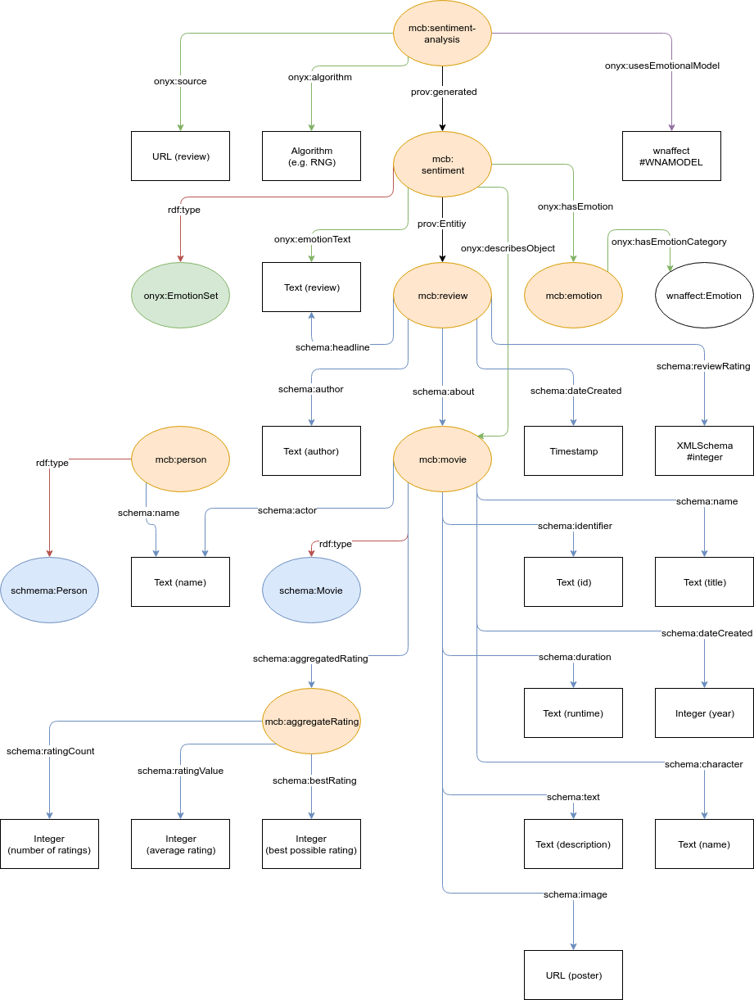
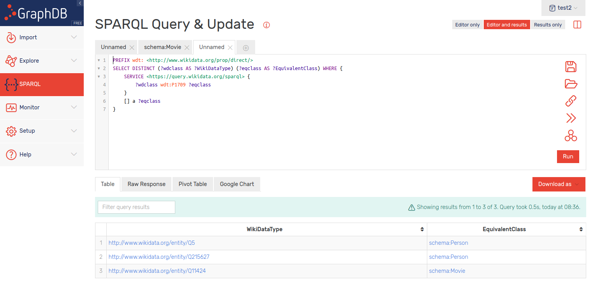

---
author:
	name1: Arno Breitfuss 
	name2: Karen Errou 
	name3: Juliette Opdenplatz
title:
	main: Semantic Web
	sub1: Proseminar Group 3
	sub2: Emotional Reasoning Chat Bot
revision:
	level: 1
	date: 07.11.2018
---

# Disclaimer

For the sake of readability, we do not include to much of our code base in here, if you want to have a look at the code, you can do so at all times by visiting our [github repository](https://github.com/julietcetera/semantic-web-course).


# Emotional Reasoning Chat Bot

## - Introduction

The goal of the proseminar is to create a chatbot that is able to perform emotional reasoning.

> Emotional reasoning is a cognitive process by which a person concludes that his/her emotional reaction proves something is true, regardless of the observed evidence.
>
> -- <cite>Wikipedia</cite>

Reasoning processes of humans are mainly different than reasoning principles of machines, as humans made decisions basing not only on logics and facts, but basing on emotions, biases and comparatively very limited information.

This project will collect and design ontologies and data representing human emotions and design reasoning mechanisms employing these.
The reasoning mechanisms can be inbuilt in practical scenarios e.g. in online marketing - designing of a chat bot that appeals to emotions of humans and trying to change their behaviour.
Or a character that goes beyond the "personal assistant" mode.

We will make use of this on a specific domain, namely movie recommendation.
By trying to extract emotions out of pre-exisiting movie reviews, we will map emotions to movies, and by extracting emotions out of the users chat log, a reasoning mechanism will try to find a good movie recommendation for the user.


## - Domain Overview

Chat bots are programs where you can communicate via text with an artificial agent.
These programs are usually designed to simulate how humans will react or behave in a conversation.
In a perfect world, chat bots should be capable of recognizing human emotions in order to respond more smoothly with situation awareness.

In general, our choice of movies are dependent on our mood.
So in order to actually get something out of our bot, we focus on a chat bot that recommends movies depending on the user's mood.

While talking to the chat bot, it should be able to detect your mood (happy, sad, angry...), and from peoples earlier reviews can recommend the best matching movies.

### Data-set Research

We mainly used *LOV* trying to find ontologies for emotion description, this is how we found *Onyx* for example.
In order to find suitable datasets, following tools were used:

- [Linked Open Vocabularies.](https://lov.linkeddata.es/dataset/lov)
- [Google dataset search.](https://toolbox.google.com/datasetsearch)
- [CKAN (datasets search).](https://ckan.org)

### Movies and their Non-numerical Reviews for Deducing Emotions

Below are some example datasets we found on [kaggle](https://www.kaggle.com/datasets?sortBy=relevance&group=public&search=movie&page=1&pageSize=20&size=sizeAll&filetype=fileTypeAll&license=licenseAll), a data set sharing platform.

[A small set of 16 movies](https://www.kaggle.com/jonsteve/user-reviews-of-16-movies-on-rotten-tomatoes) which is exactly what we needed but way to small for our needs.
[A large set of movies usually used for binary sentiment classification](http://www.cs.cornell.edu/people/pabo/movie-review-data/), [and another set of this type](http://ai.stanford.edu/~amaas/data/sentiment/).
These sets lack reviews but ship with binary classifications, however, obviously human emotions are not based on a binary, so this is kinda useless.

Even though we couldn't really make use of these sets, they were still useful since they provided us a big list of *IMDb* ids which we now use to mine the data ourselves.

### Data-mining 

Sadly, there was no data set to be found that provided everthing we need, however there are web sites out there that do so.
For now we gathered two data sets, both from websites that are online databases related to movies.
The first is [IMDb](https://www.imdb.com/) and the second is [Metacritic](https://www.metacritic.com/) which are rich in reviews and for each movie have a respective ID.
To implement them, a general data miner was built, this should help us mine more for more data if needed.

The data miner basically takes three inputs: 

 - A file that tells where to save the data and what to mine for.
 - Special files for a given kind of site like movie descriptions or reviews to specific movies. Also since different web page sources are built differently (HTML-wise), we specify different *jQuery* selectors in those files so the program knows what to mine for. This of course happens with respect to source (*IMDb* or *Metacritic*) and specific web page (movie *HTML* page or review *HTML* page).
 - Files containing lists of earlier mentioned IDs so you know exactly what pages (*URI*-wise) to mine.

Using these inputs, the data miner iterates over all the targets and retrieves the sites via an *http* request.
From the response body, it constructs a virtual *DOM* (Document Object Model), so *jQuery* can be used to extract the data, finally the data is saved into *JSON* files.

Finally, to translate the data to a semantic format, we developed a script that converts the *JSON* files into *ttl* files.

### Other Metadata

Since we already covered federated queries, and some meta information is not that easy to extract from websites, we might be able to use external *SparQL*-endpoints like the one on [linkedmdb](http://data.linkedmdb.org/sparql) to retrieve more metadata if needed.


## - Initial Vocabulary Selection and Domain Specification

### Considered Ontologies to Use

When it comes to vocabularies regarding emotions, there are a couple of choices.
In the following segment we briefly discuss the vocabularies we looked at and why we landed on *Onyx* in combination with *WNAffect*.

#### Emotion Ontology (MFOEM)

[Emotion Ontology (MFOEM)](http://www.ontobee.org/ontology/MFOEM?iri=http://purl.obolibrary.org/obo/MFOEM_000182)

According to its own description property it is: An ontology of affective phenomena such as emotions, moods, appraisals and subjective feelings, designed to support interdisciplinary research by providing unified annotations. The ontology is a domain specialisation of the broader Mental Functioning Ontology.

We found that this ontology would be overkill for our usecase, since it provides means to describe processes, we simply don't have access to.
For example, you can tell something about a persons mood by analysing their facial expression.
Even though *MFOEM* provides means to describe this process, we simply do not have that information from a simple chat log.

#### Emotion Markup Language (EmotionML)

[Emotion Markup Language (EmotionML)](https://www.w3.org/TR/emotionml/)

*EmotionML* can be used in three different areas: manual annotation of data, automatic recognition of emotion-related states from user behavior and generation of emotion-related system behavior.
While the last two points may sound well suited for our project, we found that *Onyx* was better suited for extracting emotions from text.

#### Human Emotions Onotology (HEO)

[Human Emotions Ontology (HEO)](http://citeseerx.ist.psu.edu/viewdoc/download?doi=10.1.1.460.2603&rep=rep1&type=pdf)

*HEO* was created in order to annotate multimedia with emotions.
Again, this sounds perfect for our project, but *Onyx* is still better suited when it comes to emotions extracted from text.

#### Human Stress Ontology (HSO)

[Human Stress Ontology (HSO)](https://onlinelibrary.wiley.com/doi/epdf/10.1080/00050061003664811)

As its name already gives away, HSO is specifically designed to model stress factors and relations between said factors and their countermeasures.
While *HSO* would be great for a project where movies are suggested in order to lower a user's stress level, it is not well suited for our project.

#### Linked Data Models for Emotion and Sentiment Analysis W3C Community Group

[Linked Data Models for Emotion and Sentiment Analysis W3C Community Group](https://www.w3.org/community/sentiment/)

While the ideas of the *W3C* Community regarding modeling emotions sound great, the community does not seem to be very active.

#### Onyx - An Emotion Modelling Ontology

- [Specification](http://www.gsi.dit.upm.es/ontologies/onyx/)
- [Onyx: A Linked Data Approach to Emotion Representation (paper)](http://oa.upm.es/37389/1/INVE_MEM_2015_190501.pdf)

Onyx was designed for emotions which have been extracted from text.
This suits our needs perfectly, since we want to extract the user's emotional state from their chat messages and the emotional response to a movie from the movie's reviews.
A basic example below shows a single opinion annotated with Onyx metadata (taken from the specification page):


#### WordNet-Affect Taxonomy

[WordNet-Affect Taxonomy](http://www.gsi.dit.upm.es/ontologies/wnaffect/)

*WNAffect* was desigend to link words to affects (emotions). Again this makes a lot of sense for us and *Onyx* uses the terminology of *WNAffect*.

### Our First Sketch of a Knowledge Graph

[A first glance of our graph model.](https://drive.google.com/file/d/1T9ww8kX9F9dy6ytcPoA-I7eyKJZaKS-5/view)

After deciding on how to model emotions, we did a mockup of what our knowledge graph might look like:

```
@prefix rdfs: <http://www.w3.org/2000/01/rdf-schema#>.
@prefix rdf: <http://www.w3.org/1999/02/22-rdf-syntax-ns# >.
@prefix onyx: <http://gsi.dit.upm.es/ontologies/onyx/ns>.
@prefix wna: <http://gsi.dit.upm.es/ontologies/wnaffect/ns>.

mcb:User a rdfs:Class;
    rdfs:comment "A user that is chatting with the bot";
    rdfs:label "User";
    onyx:hasEmotion [
        onyx:hasEmotionCategory wna:anger;
        onyx:hasEmotionIntensity :1.0;
    ];
    mcb:hasMovieHistory [
        schema:Movie mcb:pulp_fiction;
        schema:Movie mcb:deadpool;
    ];

mcb:Movie a rdfs:Class;
    rdfs:comment "A Movie";
    rdfs:label "Movie";
    mcb:hasRelatedEmotions [
        onyx:Emotion onyx:Sad;
        onyx:Emotion onyx:Thrilled;
    ];

mcb:hasRelatedEmotions a rdf:Property;
    rdfs:comment "Movies emotions related to them";
    rdfs:label "hasRelatedEmotions";
    rdfs:type rdf:Bag;
    rdfs:domain mcb:Movie;

mcb:hasMovieHistory a rdf:Property;
    rdfs:comment "A users history of watched movies";
    rdfs:label "MovieHistory";
    rdfs:type rdf:Bag;
    rdfs:domain mcb:User;
```

The prefix *mcb* stands for "movie chat bot" which is a placeholder for the parts which we wanted to model ourselves.
However, since there are a lot of vocabularies for movies, it would have been senseless to create our own which is why we used *schema.org/Movie* in the final approach.
This ontology covers pretty much every property of movies imaginable which is nice, but also too much for our project which is why we, for now, limited it to identifier, name, duration, release (dateCreated), description (text), aggregated rating (aggregateRating), actors, characters and poster.

### Our Crawler

As already stated before, we did not find a dataset including movies and their reviews, so we had to crawl some review sites by ourselves.
Since the basic functionality was already described, this section covers some implementation details.
The crawler is written in *JavaScript* and works by looking for specified *html tags* in the page using *jQuery*. 
In order to make it suitable for multiple data sources/review sites, the crawler is initialized with a config via *config.json*, with tags via *movies.json* and *reviews.json* and with a list of targets via *target.json*.

The results for movies are stored in seperate *JSON* files which are linked by the movies id.
Later these files can be processed by our mapper in order to map the metadata to our ontology.

#### config.json

* target_entities (movies and reviews)
    - base: the base url of the movie review website
    - postfix: the sub path of the url which comes after the movie id
    - save_dir: the directory where the result jsons are going to be stored

* already_used_targets: used to keep track of retrieved movies
* to_be_used_targets: used to keep track of movies going to be fetched
* targets: list of movies which will be retrieved be the crawler when run
* targets_dir: directory of the target jsons

Note that in this example the *starwars.json* file contains IMDb's ids for all the *Star Wars* movies out there, so we basically can create *JSON* files as arrays of IDs and put them into the config file.
We split all the IDs we got through the datasets into different *JSON* files because we simply can't send thousands of requests to one web page in just some minutes without fearing consequences (assumed DDoS attacks).
Note that it is not our goal to make web sites unusable.
Another reason for spliting targets into different files, is that we can now, in a simple way, spare us useless computation because, when we do another mining run, we don't have to crawl sites for movies we already have data on.

Example:

```
{
    "target_entities":{
        "movies":{
            "base":"https://www.imdb.com/title/",
            "postfix":"",
            "save_dir":"../../data/imdb/movies/",
            "tags":"./tags/movies.json"
        },
        "reviews":{
            "base":"https://www.imdb.com/title/",
            "postfix":"/reviews?ref_=tt_urv",
            "save_dir":"../../data/imdb/reviews/",
            "tags":"./tags/reviews.json"
        }
    },
    "already_used_targets":[],
    "to_be_used_targets":[],
    "targets":["starwars.json"],
    "targets_dir":"./targets/"
}
```

#### movies.json and reviews.json

* singular: items where a quantity of exactly 1 is expected
    - get_text: retrieve the text of a html tag
    - get_attr: retrieve the attribute of a html tag

For example, given a movie, there is one official description, and also just one official duration.

* plural: items where a quantity of >1 is expected
    - get_text: retrieve the text of a html tag
    - get_attr: retrieve the attribute of a html tag

For example, a movie as a certain set of characters and a cast usually contains multiple actors.

Example:

```
{
    "singular":{
        "get_text":{
            "movie-duration":"div.subtext time",
            "movie-rating-count":"span[itemprop='ratingCount']",
            "movie-rating-value":"span[itemprop='ratingValue']",
            "movie-best-rating":"span[itemprop='bestRating']",
            "movie-year":"span#titleYear a",
            "movie-director":"div.credit_summary_item a",
            "movie-description":"div.inline.canwrap p span"
        },
        "get_attr":{
            "movie-title":["meta[property='og:title']","content"],
            "movie-image":["meta[property='og:image']","content"],
            "movie-short-description":["meta[name='description']","content"],
            "movie-url":["meta[property='og:url']","content"],
            "movie-id":["meta[property='pageId']","content"]
        }
    },
    "plural":{
        "get_text":{
            "movie-character":"td.character a"
        },
        "get_attr":{
            "movie-actor-img":["td.primary_photo a img.loadlate","src"],
            "movie-actor":["td.primary_photo a img","alt"]
        }
    }
}
```

#### targets.json

A simple array containg movie ids (Example: starwars.json contains the ids of all Star Wars movies).

#### A Note on Generality

Since we optimally want data from more than one source, we wanted to make the crawler as resuable as possible.
We think we achieved that by only having to change the respective files that contain the *jQuery* selectors, and by, of course, providing new *target.json* files.
If you stick to the same structure for the files containing the selectors, the output format will always be the same.
This means that we can create uniform data, from different sources which is pretty neat.

### Our Mapper

The mapper takes the *JSON*s created by the crawler and puts all of the data into our knowledge graph.
This process is actually very simple since the *JSON*s contain simple dictionaries (key value pairs).
Since we generate uniform data, our mapper works for all the sources, so we don't have to adapt the mapper, when changing sources.

#### Movies

1. Iterate over all actors and create an instance of *schema:Person* for each actor
2. Create a *schema:aggregateRating* containing the number of ratings, the rating and the max. rating
3. Create an instance of *schema:Movie* and add all of the crawled metadata to it

#### Reviews

1. Create an entity of the review and add all of the crawled metadata to it
2. Create an *onyx:EmotionSet* which links an *wnaffect* emotion to the review
3. Create an analysis which describes how the *onyx:EmotionSet* was obtained (currently this is done randomly)

### Restrictions of the Used Ontologies

We mainly use [schema.org](https://schema.org/) and [Onyx](http://www.gsi.dit.upm.es/ontologies/onyx/), however, there is no ontology we know of that allows you to map emotions to movies, so we basically use the two named ontologies to do that ourselves.

### Where We Are Now

Example sub graph of our knowledge graph in *Turtle* format (Note that entries for users are still missing since we do not have any chatting interface yet):

```
@base <http://movie.chatbot.org/>.
@prefix schema: <http://schema.org/>.
@prefix onyx: <http://www.gsi.dit.upm.es/ontologies/onyx/ns#>.
@prefix rdfs: <http://www.w3.org/2000/01/rdf-schema#>.
@prefix rdf: <http://www.w3.org/1999/02/22-rdf-syntax-ns#>.
@prefix prov: <http://www.w3.org/ns/prov#>.
@prefix wnaffect: <http://www.gsi.dit.upm.es/ontologies/wnaffect/ns#>.

<#Hate>
    onyx:hasEmotionCategory wnaffect:Hate.

< ... > # emotions left out for readability

<#EmiliaClarke>
    rdf:type schema:Person;
    schema:name "Emilia Clarke".

< ... > # actors left out for readability

<#tt3778644-aggregateRating>
    schema:ratingCount 166,212;
    schema:ratingValue 7.0;
    schema:bestRating 10;
    schema:itemReviewed <#tt3778644>.

<#tt3778644>
    rdf:type schema:Movie;
    schema:identifier "tt3778644";
    schema:name "Solo A Star Wars Story (2018)";
    schema:duration "2h15min";
    schema:dateCreated "2018";
    schema:text "Description...";
    schema:aggregateRating <#tt3778644-aggregateRating>;
    schema:actor "Emilia Clarke";
    < ... > # actors left out for readability
    schema:character "Qi'ra";
    < ... > # characters left out for readability
    schema:image "https://m.media-amazon.com/images/M/MV5BOTM2NTI3NTc3Nl5BMl5BanBnXkFtZTgwNzM1OTQyNTM@._V1_UY1200_CR90,0,630,1200_AL_.jpg".

<#tt3778644-poopville>
    schema:about <#tt3778644>;
    schema:author "poopville";
    schema:dateCreated "Mon Aug 06 2018 00:00:00 GMT+0200 (CEST)";
    schema:reviewRating 7;
    schema:headline "Review...".

<#tt3778644-poopville-sentiment>
    rdf:type onyx:EmotionSet;
    onyx:emotionText "Review...";
    onyx:describesObject <#tt3778644-poopville-sentiment>;
    onyx:hasEmotion <#Hate>;
    prov:Entity <#tt3778644-poopville>.

<#tt3778644-poopville-sentiment-analysis>
    onyx:algorithm "RNG";
    onyx:source "http://www.imdb.com/title/tt3778644/reviews";
    onyx:usesEmotionalModel "http://www.gsi.dit.upm.es/ontologies/wnaffect#WNAModel";
    prov:generated <#tt3778644-poopville-sentiment>.
```

The same example sub graph as a visual graph:



### Derived Axioms

 - A movie has to have one unique id
 - A movie has either one or zero Metacritic ids
 - An actor is a person
 - A movie can have multiple genres but at least 1
 - A movie can have multiple languages or none
 - Pulp Fiction is different from Star Wars
 - Two movies can have the same title
 - The domain of schema:actor is a movie

## - Triple Storage and Querying

### Overview of the Selected Triple Store

We decided to use *GraphDB* as our triple store and our first contact with it was really nice.
The installation was straight forward and setting it up basically took no time, which is not that common for database systems.
It also provides a very simple way to upload our *ttl* files, and a neat interface for testing *SparQL* queries.
Another argument for *GraphDB* is its REST API which basically works with every programming language, instead of limiting us to some library and thus to a certain set of languages.
This is an important point, since we wanted to use *Node.js* simply because it's really nice for handling *JSON* formatted data.

> GraphDB is a family of highly-efficient, robust and scalable RDF databases. It streamlines the load and use of linked data cloud datasets as well as your own resources. For an easy use and compatibility with the industry standards, GraphDB implements the RDF4J framework interfaces, the W3C SPARQL Protocol specification and supports all RDF serialisation formats.
>
> -- <cite>GraphDB Web Site</cite>

#### Heroku Deployment

**NOTE** that apparently the *Heroku* server on which our *docker* graphdb image performs quite poorly, which causes the app to crash regularly.
This again causes the whole image to restart and thus loss of all uploaded data and created repositories.
Also the server does not respond very quickly, if at all, and only to *http* - not *https* requests.
It's basically unusable, but we wanted you to know that we tried to give you the option to test our result for yourself.

[You may try your luck, if you dare to.](http://emotional-reasoning-graph.herokuapp.com/)

#### Local Installation

The local installation works really fine as you can see from the following screenshot, where we show off the *advanced query*, and its results.



### Exploratory Queries on the Loaded Dataset

#### The distinct wikidata types that may be aligned with the types in your dataset (advanced query)

```
PREFIX wdt: <http://www.wikidata.org/prop/direct/>
SELECT DISTINCT (?wdc AS ?WikiDataClass) (?eqc AS ?EquivalentClass) WHERE {
    SERVICE <https://query.wikidata.org/sparql> {
	# wdt:P1709 - equivalent class
	# its description even says from other ontologies
        ?wdc wdt:P1709 ?eqc .
    }
    [] a ?eqc .
}
```

|           WikiDataClass                | EquivalentClass |
|:--------------------------------------:|:---------------:|
| http://www.wikidata.org/entity/Q5      | schema:Person   |
| http://www.wikidata.org/entity/Q215627 | schema:Person   |
| http://www.wikidata.org/entity/Q11424  | schema:Movie    |

#### Total number of triples

```
SELECT (COUNT(?s) AS ?triples)
WHERE {
    ?s ?p ?o
}
```

|        triples        |
|:---------------------:|
| "152198"^^xsd:integer |

#### Total number of instantiations

```
SELECT (COUNT(?s) AS ?instances)
WHERE {
    ?s a []
}
```

|       instances      |
|:--------------------:|
| "15449"^^xsd:integer |

#### Total number of distinct classes

```
SELECT (COUNT(DISTINCT ?c) AS ?classes)
WHERE {
    [] a ?c
}
```

|      classes      |
|:-----------------:|
| "10"^^xsd:integer |

#### Total number of distinct properties

```
SELECT (COUNT(DISTINCT ?p) AS ?properties)
WHERE {
    [] ?p []
}
```

|    properties     |
|:-----------------:|
| "34"^^xsd:integer |

#### List of all classes used in your dataset per data source (see named graphs)

```
SELECT DISTINCT (?g AS ?graphs) (?c AS ?classes)
WHERE {
    GRAPH ?g {
        [] a ?c
    }
}
```

| graphs                      | classes         |
|:----------------------------|:----------------|
| https://www.metacritic.com/ | schema:Movie    |
| https://www.metacritic.com/ | onyx:EmotionSet |
| https://www.imdb.com/       | schema:Person   |
| https://www.imdb.com/       | schema:Movie    |
| https://www.imdb.com/       | onyx:EmotionSet |

#### List of all properties used in your dataset per data source

```
SELECT DISTINCT (?g AS ?graphs) (?p AS ?properties)
WHERE {
    GRAPH ?g {
        [] ?p []
    }
}
```

| graphs                      | properties              |
|:----------------------------|:------------------------|
| https://www.metacritic.com/ | rdf:type                |
| http://imdb.com/            | rdf:type                |
| https://www.metacritic.com/ | onyx:hasEmotionCategory |
| http://imdb.com/            | onyx:hasEmotionCategory |
| ...                         | ...                     |

#### Total number of instances per class per data source (reasoning on and off)

```
SELECT DISTINCT (?g as ?graphs) (?c as ?classes) (COUNT(?s) AS ?instances)
WHERE {
    GRAPH ?g {
        ?s a ?c
    }
}
GROUP BY ?g ?c
```

##### Reasoning On

| graphs                      | classes         |           instances |
|:----------------------------|:----------------|--------------------:|
| https://www.metacritic.com/ | schema:Movie    |    "1"^^xsd:integer |
| https://www.metacritic.com/ | onyx:EmotionSet |   "43"^^xsd:integer |
| http://imdb.com/            | schema:Person   | "6712"^^xsd:integer |
| http://imdb.com/            | schema:Movie    |  "468"^^xsd:integer |
| http://imdb.com/            | onyx:EmotionSet | "8168"^^xsd:integer |

##### Reasoning Off

Did not seem to make a difference.

#### Total number of distinct subjects per property per data source 

```
SELECT DISTINCT (?g as ?graphs) (?p AS ?properties) (COUNT(DISTINCT ?s) AS ?subjects)
WHERE {
    GRAPH ?g {
        ?s ?p []
    }
}
GROUP BY ?g ?p
```

| graphs                      | properties              |             subjects |
|:----------------------------|:------------------------|---------------------:|
| https://www.metacritic.com/ | rdf:type                |    "44"^^xsd:integer |
| http://imdb.com/            | rdf:type                | "15348"^^xsd:integer |
| https://www.metacritic.com/ | onyx:hasEmotionCategory |    "29"^^xsd:integer |
| http://imdb.com/            | onyx:hasEmotionCategory |    "29"^^xsd:integer |
| ...                         | ...                     |                  ... |

#### Total number of distinct objects per property per data source

```
SELECT DISTINCT (?g as ?graphs) (?p AS ?properties) (COUNT(DISTINCT ?o) AS ?objects)
WHERE {
    GRAPH ?g {
        [] ?p ?o
    }
}
GROUP BY ?g ?p
```

| graphs                      | properties              |           objects |
|:----------------------------|:------------------------|------------------:|
| https://www.metacritic.com/ | rdf:type                |  "2"^^xsd:integer |
| http://imdb.com/            | rdf:type                |  "3"^^xsd:integer |
| https://www.metacritic.com/ | onyx:hasEmotionCategory | "29"^^xsd:integer |
| http://imdb.com/            | onyx:hasEmotionCategory | "29"^^xsd:integer |
| ...                         | ...                     |               ... |

#### Distinct properties used on top 5 classes in terms of amount of instances (reasoning on and off)

```
SELECT DISTINCT (?p AS ?properties)
WHERE {
    ?s ?p [] .
    ?s a ?c .
    {
        # sub query for top 5 classes in terms of amount of instances
        SELECT ?c (COUNT(?s) as ?count)
        WHERE {
            ?s a ?c
        }
        GROUP BY ?c
        ORDER BY DESC (COUNT(?s))
        LIMIT 5
    }
}
```

##### Reasoning On

|                       properties                       |
|:------------------------------------------------------:|
|                        rdf:type                        |
|                    onyx:emotionText                    |
|                  onyx:describesObject                  |
|                    onyx:hasEmotion                     |
|                      prov:Entity                       |
|                      schema:name                       |
|                   schema:identifier                    |
|                    schema:duration                     |
|                   schema:dateCreated                   |
|                      schema:text                       |
|                 schema:aggregateRating                 |
|                      schema:image                      |
|                      schema:actor                      |
|                    schema:character                    |
|                   rdfs:subPropertyOf                   |
| http://proton.semanticweb.org/protonsys#transitiveOver |
|                      rdfs:domain                       |
|                       rdfs:range                       |
|                     owl:inverseOf                      |

19 distinct properties used on top 5 classes in terms of amount of instances.

##### Reasoning Off

|       properties       |
|:----------------------:|
|        rdf:type        |
|    onyx:emotionText    |
|  onyx:describesObject  |
|    onyx:hasEmotion     |
|      prov:Entity       |
|      schema:name       |
|   schema:identifier    |
|    schema:duration     |
|   schema:dateCreated   |
|      schema:text       |
| schema:aggregateRating |
|      schema:image      |
|      schema:actor      |
|    schema:character    |

14 distinct properties used on top 5 classes in terms of amount of instances.


## - Conclusion and Next Steps

Now that we gathered some data, the next logical step would be to find a way to translate the reviews into annotations of emotions.
However, we found that the quality of the reviews in regards of length and emotional wording varies a lot between data sources and especially between authors.
We will have to see how well these reviews are suited for our needs and maybe even involve movie scripts in order to obtain an annotation of emotions, which may give better results.

Whichever we choose, in the end we will also have to define a way to process natural language.
This mechanism is important for the process of extracting an annotation of emotion from our data sources as well as for obtaining an emotional state from the user by processing their chat messages.

Compared to other movie databases ours still is really small, so we will have to mine more data, especially from other sources than *IMDb*, since we want diverse data.
In order to have access to even more data, building links to other databases would be nice, as already mentioned we could do so by constructing federated queries.

Then we will have to discuss, when we recommend what kind of movie, since there are lots of occasions where you'd classify some emotional state as indesirable, however a user might actually want to feel that exact same emotion.
This becomes clearer when you think about horror movies or sad dramas, for instance.
Sometimes people apparently just want to be sad or whatever.

Then there is the natural language generation which we will need for actually giving our chat bot a voice.

In the following are some thoughts we noted about how to approach the natural language processing.

### Natural Language Processing

#### npm natural

- [Text tagger](https://github.com/NaturalNode/natural#pos-tagger)
- [Automatically Constructing a Dictionary for Information Extraction Tasks](https://www.cs.utah.edu/~riloff/pdfs/aaai93.pdf)

#### POS tagger

|tag |meaning              |examples  |
|:--:|:-------------------:|:--------:|
|CC  | Coord Conjunction   |and,but,or|
|CD  | Cardinal number     |one,two   |
|DT  | Determiner          |the,some  |
|EX  | Existential there   |there     |
|FW  | Foreign Word        |mon dieu  |
|IN  | Preposition         |of,in,by  |
|JJ  | Adjective           |big       |
|JJR | Adj., comparative   |bigger    |
|JJS | Adj., superlative   |biggest   |
|LS  | List item marker    |1,One     |
|MD  | Modal               |can,should|
|NN  | Noun, sing. or mass |dog       |
|NNP | Proper noun, sing.  |Edinburgh |
|NNP |S Proper noun, plural|Smiths    |
|NNS | Noun, plural        |dogs      |
|POS | Possessive ending   |O's       |
|PDT | Predeterminer       |all, both |
|PP$ | Possessive pronoun  |my,one's  |
|PRP | Personal pronoun    |I,you,she |
|RB  | Adverb              |quickly   |
|RBR | Adverb, comparative |faster    |
|RBS | Adverb, superlative |fastest   |
|RP  | Particle            |up,off    |
|SYM | Symbol              |+,%,&     |
|TO  | ÒtoÓ                |to        |
|UH  | Interjection        |oh, oops  |
|VB  | verb, base form     |eat       |
|VBD | verb, past tense    |ate       |
|VBG | verb, gerund        |eating    |
|VBN | verb, past part     |eaten     |
|VBP | Verb, present       |eat       |
|VBZ | Verb, present       |eats      |
|WDT | Wh-determiner       |which,that|
|WP  | Wh pronoun          |who,what  |
|WP$ | Possessive-Wh       |whose     |
|WRB | Wh-adverb           |how,where |
|,   | Comma               |,         |
|.   | Sent-final punct    |. ! ?     |
|:   | Mid-sent punct.     |: ; Ñ     |
|$   | Dollar sign         |$         |
|#   | Pound sign          |#         |
|"   | quote               |"         |
|(   | Left paren          |(         |
|)   | Right paren         |)         |

[Table is from here.](https://github.com/dariusk/pos-js)

### Response Sentence Creation

- [npm naturals bayesian classifier](https://github.com/NaturalNode/natural#bayesian-and-logistic-regression)
