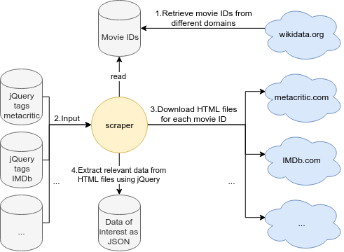
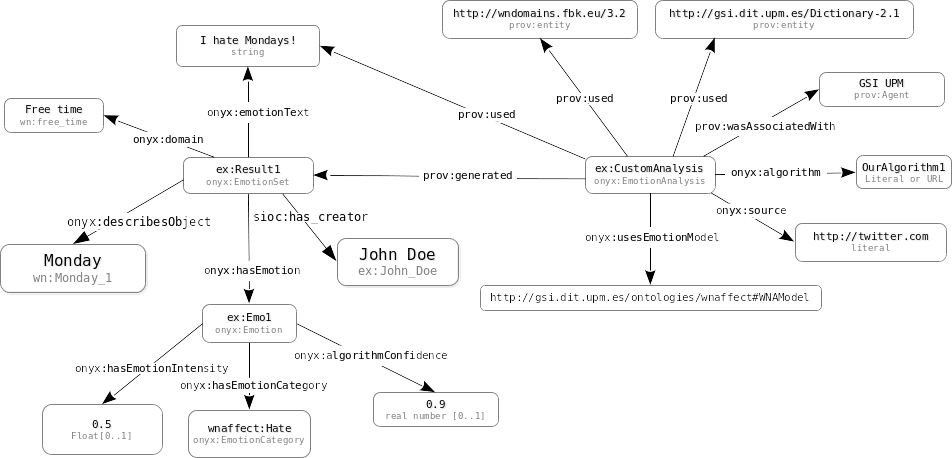
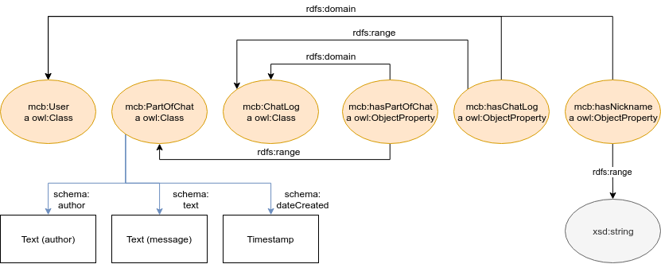
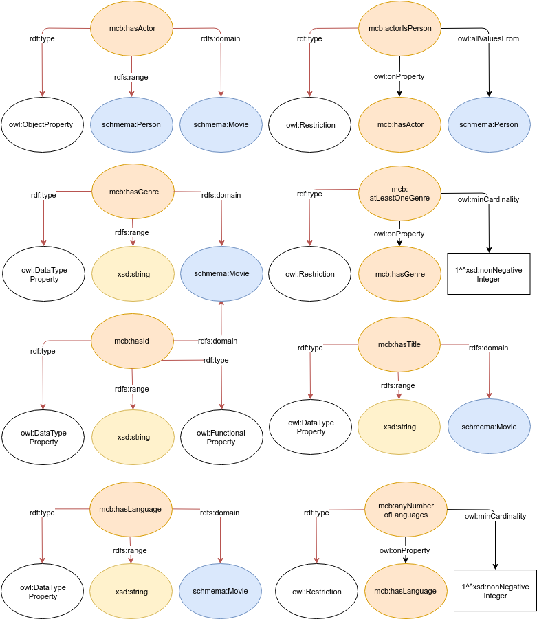
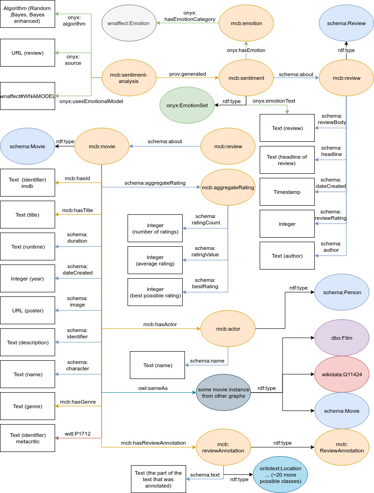

---
author:
    name1: Arno Breitfuss 
    name2: Karen Errou 
    name3: Juliette Opdenplatz
title:
    main: Semantic Web
    sub1: Proseminar Group 3
    sub2: Emotional Reasoning Chat Bot
revision:
    level: 1
    date: 14.02.2019
---

# Disclaimer

For the sake of readability, we do not include too much of our code base in here,
if you want to have a look at the code,
you can do so at all times by visiting our [github repository](https://github.com/julietcetera/semantic-web-course).
Where applicable, we provide more specific links, maybe also to *outsourced* repositories.

# Emotional Reasoning Chat Bot

## - Introduction

The goal of the proseminar was to create a knowledge graph for a given domain.
As our domain we chose to create a chat bot that is able to perform emotional reasoning.

> Emotional reasoning is a cognitive process by which a person concludes that his/her emotional reaction proves something is true, regardless of the observed evidence.
>
> -- <cite>Wikipedia</cite>

This project will collect and design ontologies in order to represent human emotions,
as well as design reasoning mechanisms employing these.
The reasoning mechanisms can be inbuilt in practical scenarios e.g. in online marketing - designing of a chat bot that appeals to emotions of humans and trying to change their behaviour.
Or a character that goes beyond the "personal assistant" mode.

We will make use of this on a specific domain, namely movie recommendation.
By trying to extract emotions out of pre-exisiting movie reviews,
we mapped emotions to movies, and by extracting emotions out of the users chat log,
a reasoning mechanism will try to find a good movie recommendation for the user.

### - Domain Overview

Chat bots are programs where you can communicate via text with an artificial agent.
These programs are usually designed to simulate how humans will react or behave in a conversation.
In a perfect world, chat bots should be capable of recognizing human emotions in order to respond more smoothly with situation awareness.

In general, our choice of movies are dependent on our mood.
So in order to actually get something out of our bot,
we focussed on a chat bot that recommends movies depending on the user's mood.

While talking to the chat bot, it is able to detect your mood (happy, sad, angry...),
and from peoples earlier reviews can recommend the best matching movies.

### - Use Case

Below the application's typical behaviour is described:

1. A user sends a message - e.g.: "Hello"
2. The bot responds with an arbitrary message - e.g.: "How are you?"
3. The user responds - e.g.: "I am sad. My cat died this morning."
4. The user's message is analyzed in order to obtain an emotion.
5. The emotion is used to suggest a movie to the user.
6. The user can choose if they would like to watch a movie reflecting their current mood or if they would rather try to change their current mood.
7. Based on the user's choice a movie is recommended.

## - Data Sources

Sadly, there was no data set to be found that provided everthing we needed, however there are web sites out there that do so.
Thus, in order to categorize movies, preprocessing steps had to be made.
We gathered information about movies from [IMDb](https://www.imdb.com/) and [metacritic](https://www.metacritic.com/) using web scraping techniques.
Since different resources (movies) have different URLs,
we needed to somehow gather the movie's internal ids for both web sites.
We did so using the *wikidata knowledge base*,
which provides exactly that with the `P345` property for IMDb movie IDs as well as the `P1712` property for metacritic IDs.
So by using the following query, we were able to retrieve a list of all IMDb IDs,
and if there is also a metacritic ID for that movie, we get that as well.
```
SELECT ?item ?imdb ?metacritic
WHERE 
{
  ?item wdt:P345 ?imdb.
  OPTIONAL {?item wdt:P1712 ?metacritic}
}
```

### - Web Scraping 

For the gathering of data to be done effeciently and scalable,
a [generalized web scraping service](https://github.com/julietcetera/data-miner-js) was built.
It iterates over every movie ID we previously retrieved,
then constructs the necessary *URL*s to send an *HTTP* request in order to get the *HTML* files.
From these *HTML* files it constructs a virtual *Document Object Model (DOM)*,
with respective predefined tags,
it then can use *jQuery* on the *DOM* to extract the data of interest.



### - Other Metadata

Initially, we planned to provide links to [linkedmbd](http://www.linkedmdb.org/), however,
sadly this service seems to be discontinued.

Since the IDs were gathered using the *wikidata knowledge base*,
there also for every movie we have in our database, is an equivalent on wikidata,
Due to that, we were easily able to create linking to wikidata,
and thus, profit from the data provided, by using federated *SPARQL*-queries.

Also since *DBpedia* maintains links in form of *owl:sameAs* relations to *wikidata*,
we were also able to enrich our database with links to *DBpedia*.
```
PREFIX schema: <http://schema.org/>
PREFIX owl: <http://www.w3.org/2002/07/owl#>
PREFIX dbpedia-owl: <http://dbpedia.org/ontology/>
SELECT ?film ?wdlink ?dblink WHERE {
    SERVICE <http://dbpedia.org/sparql> {
        ?dblink a dbpedia-owl:Film .
        ?dblink owl:sameAs ?wdlink
    }
    ?film a schema:Movie .
    ?film owl:sameAs ?wdlink
}
```

## Knowledge Graph

The requirements to our knowledge graph were kind of clear from the get-go.
They also did not change too much, making lots of refactoring unnecessary. 
At the end of this section a visualization of the main parts of our graph is provided.

### Vocabularies Used

Reuse of existing vocabularies is important, since the definition says,
that an ontology should be a *shared* conceptualization.

#### Schema.org

> Schema.org is a collaborative, community activity with a mission to create, maintain, and promote schemas for structured data on the Internet, on web pages, in email messages, and beyond.
>
> -- <cite>https://schema.org/</cite>

We mainly make use of *schema.org*'s movie and review model, to describe our scraped data sets. 

#### Onyx - An Emotion Modelling Ontology

Onyx was designed for modelling emotions which have been extracted from text.
This suits our needs perfectly,
since we want to extract the user's emotional state from their chat messages as well as the emotional response to a movie from the movie's reviews.
A basic example below shows a single opinion annotated with Onyx metadata (taken from the [specification page](http://www.gsi.dit.upm.es/ontologies/onyx/)):



[Onyx: A Linked Data Approach to Emotion Representation (paper)](http://oa.upm.es/37389/1/INVE_MEM_2015_190501.pdf)

#### WNAffect

[*WNAffect*](http://www.gsi.dit.upm.es/ontologies/wnaffect/) was designed to link words to affects (emotions).
Again this makes a lot of sense for us and *Onyx* uses the terminology of *WNAffect*.

#### Self Defined Parts

##### User Data

Since we wanted to be able to restore the chat log of a user,
we had to somehow model that in our graph.
Usually, you probably would use some other type of database, for instance, document stores.
However, we did not want to include even more dependencies,
so we decided to just stick with *GraphDB* for that.



##### Owl Axioms

TODO



##### Schema.org Actions

TODO

 - Watch Action

##### Shacl Shapes

Since one could theoretically add any kind of triple,
we use *SHACL* shapes in order to validate our produced RDF-files.
We do that mainly for movie-related data.

###### User/Chat Related Data

```
@prefix dash: <http://datashapes.org/dash#> .
@prefix rdf: <http://www.w3.org/1999/02/22-rdf-syntax-ns#> .
@prefix rdfs: <http://www.w3.org/2000/01/rdf-schema#> .
@prefix schema: <http://schema.org/> .
@prefix sh: <http://www.w3.org/ns/shacl#> .
@prefix xsd: <http://www.w3.org/2001/XMLSchema#> .
@prefix mcb: <http://movie.chatbot.org/> .

mcb:UserShape
	a sh:NodeShape ;
	sh:targetClass mcb:ChatLog ;
    sh:closed false ;
	sh:property [
		sh:path mcb:hasChatLog ;
		sh:datatype sh:IRI ;
		sh:maxCount 1 ;
		sh:minCount 1 ;
		sh:severity sh:Warning ;
		sh:message "A user should have exactly 1 ChatLog!"@en ;
	] ;
	sh:property [
		sh:path mcb:hasNickName;
		sh:datatype xsd:string ;
		sh:pattern "[a-zA-Z0-9]" ;
		sh:minLength 1 ;
		sh:maxLength 16 ;
		sh:maxCount 1 ;
		sh:minCount 1 ;
		sh:severity sh:Violation ;
		sh:message "A user has to have exactly 1 nickname!"@en ;
	] .

mcb:ChatLogShape
	a sh:NodeShape ;
	sh:targetClass mcb:ChatLog ;
	sh:property [
		sh:path mcb:hasPartOfChat ;
		sh:datatype sh:IRI ;
		sh:minCount 1 ;
	] .

mcb:PartOfChatShape
	a sh:NodeShape ;
	sh:targetClass mcb:PartOfChat ;
	sh:property [
		sh:path schema:author ;
		sh:datatype xsd:string ;
		sh:pattern "[a-zA-Z0-9]" ;
		sh:minLength 1 ;
		sh:maxLength 16 ;
		sh:maxCount 1 ;
		sh:minCount 1 ;
	] ;
	sh:property [
		sh:path schema:text ;
		sh:datatype xsd:string ;
		sh:pattern "[a-zA-Z0-9!?.]" ;
		sh:minLength 1 ;
		sh:maxLength 256 ;
		sh:maxCount 1 ;
		sh:minCount 1 ;
	] ;
	sh:property [
		sh:path schema:dateCreated ;
		sh:datatype xsd:integer ;
		sh:maxCount 1 ;
		sh:minCount 1 ;
		sh:minInclusive 0 ;
	] .
```

###### Movie Related Data

```
@prefix mcb: <http://movie.chatbot.org/> .
@prefix sh: <http://www.w3.org/ns/shacl#> .
@prefix schema: <http://schema.org> .
@prefix xsd: <http://www.w3.org/2001/XMLSchema> .
@prefix rdf: <http://www.w3.org/1999/02/22-rdf-syntax-ns#> .

mcb:MovieShape
	a sh:NodeShape ;
	sh:targetClass schema:Movie ;
    sh:closed false ;
    sh:ignoredProperties (rdf:type) ;
	sh:property [
		sh:path mcb:hasId ;
		sh:datatype xsd:string ;
		sh:minCount 1 ;
		sh:maxCount 1 ;
		sh:severity sh:Violation ;
		sh:message "A movie has to have exactly one id!"@en ;
	] ;
	sh:property [
		sh:path mcb:hasTitle ;
		sh:datatype xsd:string ;
		sh:minCount 1 ;
		sh:severity sh:Warning ;
		sh:message "A movie should have at least one title!"@en ;
	] ;
	sh:property [
		sh:path mcb:hasGenre ;
		sh:datatype xsd:string ;
		sh:minCount 1 ;
		sh:severity sh:Warning ;
		sh:message "A movie should have at least one genre!"@en ;
	] ;
	sh:property [
		sh:path mcb:hasLanguage ;
		sh:datatype xsd:string ;
		sh:minCount 1 ;
		sh:severity sh:Warning ;
		sh:message "A movie should have at least one language!"@en ;
	] ;
	sh:property [
		sh:path schema:duration ;
		sh:datatype xsd:string ;
		sh:severity sh:Warning ;
	] ;
	sh:property [
		sh:path schema:dateCreated ;
		sh:datatype xsd:string ;
		sh:severity sh:Warning ;
	] ;
	sh:property [
		sh:path schema:aggregateRating;
		sh:datatype xsd:IRI ;
		sh:severity sh:Violation ;
	] ;
	sh:property [
		sh:path mcb:hasActor ;
		sh:datatype xsd:IRI ;
		sh:severity sh:Violation ;
	] ;
	sh:property [
		sh:path schema:image ;
		sh:datatype xsd:anyURI ;
		sh:severity sh:Violation ;
	] ;
	sh:property [
		sh:path schema:musicBy ;
		sh:datatype xsd:anyURI ;
		sh:severity sh:Violation ;
		sh:deactivated true ;
	] .

mcb:ReviewShape
    a sh:NodeShape ;
    sh:targetClass schema:Review ;
    sh:property [
        sh:path schema:headline ;
		sh:datatype xsd:string ;
		sh:minCount 1 ;
		sh:severity sh:Violation ;
    ] ;
    sh:property [
        sh:path schema:about ;
		sh:datatype xsd:IRI ;
		sh:severity sh:Violation ;
    ] ;
    sh:property [
        sh:path schema:author ;
		sh:datatype xsd:string ;
		sh:minCount 1 ;
		sh:severity sh:Violation ;
    ] ;
    sh:property [
        sh:path schema:dateCreated ;
		sh:datatype xsd:string ;
		sh:minCount 1 ;
		sh:severity sh:Violation ;
    ] ;
    sh:property [
        sh:path schema:reviewRating ;
        sh:datatype xsd:integer ;
		sh:severity sh:Violation ;
    ] ;
    sh:property [
        sh:path schema:reviewBody ;
		sh:datatype xsd:string ;
		sh:minCount 1 ;
		sh:severity sh:Violation ;
    ] .

mcb:EmotionSetShape
    a sh:NodeShape ;
    sh:targetClass onyx:EmotionSet ;
    sh:closed true ;
    sh:property [
        sh:path onyx:emotionText ;
        sh:datatype xsd:string ;
		sh:severity sh:Violation ;
    ] ;
    sh:property [
        sh:path onyx:hasEmotion ;
		sh:datatype xsd:IRI ;
		sh:severity sh:Violation ;
    ] ;
    sh:property [
        sh:path prov:Entity ;
		sh:datatype xsd:IRI ;
		sh:severity sh:Violation ;
    ] ;
    sh:property [
        sh:path onyx:describesObject ;
		sh:datatype xsd:IRI ;
		sh:severity sh:Violation ;
    ] .
```

##### NLP Review Annotations

TODO

#### Linked Open Data

TODO

 - Graph Alignments

### The Final Knowledge Graph

TODO



#### Knowledge Graph Statistics

TODO

 - \# of Triples etc

#### Linked Open Data

TODO

## Application

TODO

 - Workflow Diagram

### Preprocessing

TODO

 - Web Scraping
 - Data Mapper
 - Emotional Analysis of Reviews
 - SHACL Validation

### Backend

TODO

 - GraphDB
 - Markov Chains
 - Bayesian Classifier 

### Frontend

TODO

 - Web Socket - Chat/User Interface
 - Markov Chains
 - Web Service - Schema.org Actions

## Deployment

TODO

 - Raspi ngrok installation

## Conclusion

TODO
