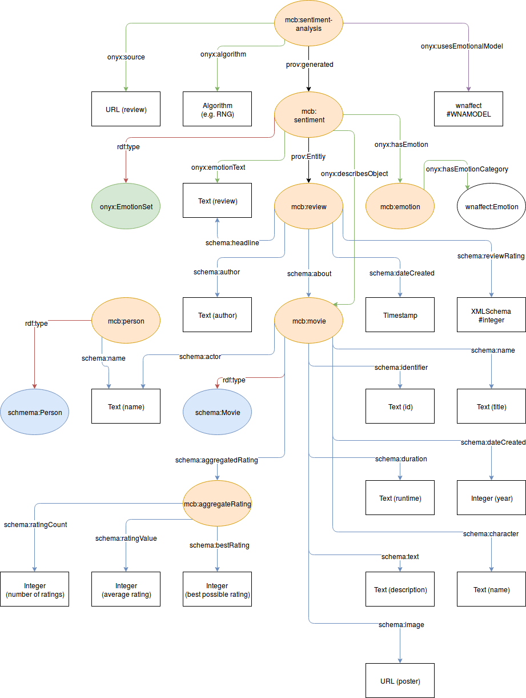
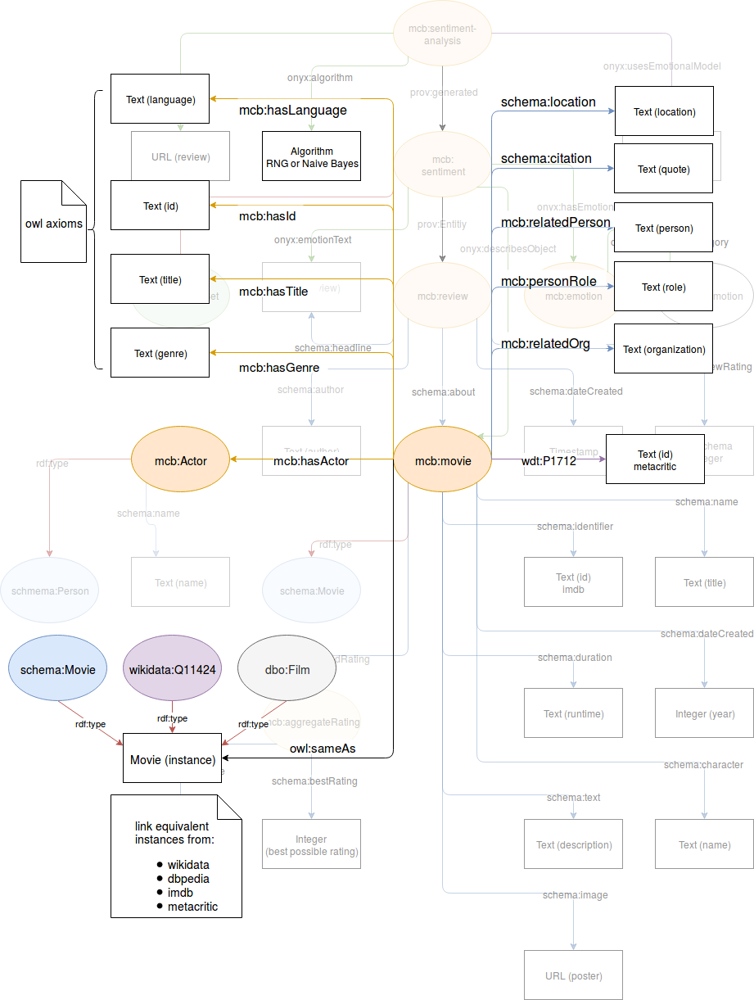

---
author:
    name1: Arno Breitfuss 
    name2: Karen Errou 
    name3: Juliette Opdenplatz
title:
    main: Semantic Web
    sub1: Proseminar Group 3
    sub2: Emotional Reasoning Chat Bot
revision:
    level: 1
    date: 07.02.2019
---

# Disclaimer

For the sake of readability, we do not include to much of our code base in here, if you want to have a look at the code, you can do so at all times by visiting our [github repository](https://github.com/julietcetera/semantic-web-course).

# Emotional Reasoning Chat Bot

## - Introduction

The goal of the proseminar was to create a chatbot that is able to perform emotional reasoning.

> Emotional reasoning is a cognitive process by which a person concludes that his/her emotional reaction proves something is true, regardless of the observed evidence.
>
> -- <cite>Wikipedia</cite>

Reasoning processes of humans are mainly different than reasoning principles of machines, as humans made decisions basing not only on logics and facts, but basing on emotions, biases and comparatively very limited information.

Since this decision process is rather difficult to model in a machine readable way, we focused on a specific domain for this project, namely movie recommendation. We designed ontologies which enable us to annotate reviews of movies with emotions. Thus, using these annotations we are able to provide a reasonable emotion based response to a user's chat message.

### - Use Case

1. A user sends a message - e.g.: "Hello"
2. The bot responds with an arbitrary message - e.g.: "How are you?"
3. The user responds - e.g.: "I am sad. My cat died this morning."
4. The user's message is analyzed in order to obtain an emotion.
5. The emotion is used to suggest an array of movies to the user.
6. The user can choose if they would like to watch a movie reflecting their current mood or if they would rather try to change their current mood.

### - Data Sources

At first we looked into various database dumps of movie data (e.g. https://www.imdb.com/interfaces/). What became quickly obvious with this approach is the fact that all of the database dumps we found did not include movies. For this reason we went a different route - data minging. We decided to mine two websites, namely [IMDb](https://www.imdb.com/) and [Metacritic](https://www.metacritic.com/).

#### Data-mining 

Since websites are often structured very differently, we built a generic data miner which can be used for various websites. The data miner basically takes three inputs: 

 - A file that tells where to save the data and what to mine for.
 - Special files for a given kind of site like movie descriptions or reviews to specific movies. Also since different web page sources are built differently (HTML-wise), we specify different *jQuery* selectors in those files so the program knows what to mine for. This of course happens with respect to source (*IMDb* or *Metacritic*) and specific web page (movie *HTML* page or review *HTML* page).
 - Files containing lists of earlier mentioned IDs so you know exactly what pages (*URI*-wise) to mine.

Using these inputs, the data miner iterates over all the targets and retrieves the sites via an *http* request.
From the response body, it constructs a virtual *DOM* (Document Object Model), so *jQuery* can be used to extract the data, finally the data is saved into *JSON* files.

Finally, to translate the data to a semantic format, we developed a script that converts the *JSON* files into *ttl* files.

#### Other Metadata

Some meta information is not easy to extract from websites. Thus we used federated queries on external *SparQL*-endpoints like the one on [linkedmdb](http://data.linkedmdb.org/sparql) to retrieve more metadata.

#### Dataset Statistics

We put the data of both websites in one named graph each. The statistics we want to show include three of the classes which are part of our final ontology. *schema:Movie* describes an instance of a movie (i.e. how many movies). *onyx:EmotionSet* describes a link of a review to its corresponding emotion (i.e. how many reviews and emotion annotations). *schema:Person* describes a person, which is usually an actor or director. As you can see, the person class is only present in the imdb-graph. In order to obtain such information for the movies from metacritic, we had to use LOD.

| metacritic.com | metacritic.com  |   imdb.com    |   imdb.com   |    imdb.com     |
|:--------------:|:---------------:|:-------------:|:------------:|:---------------:|
|  schema:Movie  | onyx:EmotionSet | schema:Person | schema:Movie | onyx:EmotionSet |
|     11,681     |     110,876     |    565,063    |   171,536    |    1,768,320    |

In the final knowledge graph we have *37,798,497 triples* and *3,566,761 individuals*.

### Final Ontology

Our final ontology can best be explained in two layers. The first layer contains the basics which are expected when modelling an ontology for movies. The second layer contains all the enhancements we added during the semester. For the emotion modelling we used [Onyx: A Linked Data Approach to Emotion Representation (paper)](http://oa.upm.es/37389/1/INVE_MEM_2015_190501.pdf) in combination with the [WordNet-Affect Taxonomy](http://www.gsi.dit.upm.es/ontologies/wnaffect/). All the movie metadata is described using *schema.org* annotations.

#### First Layer

The central class is *mcb:Movie* which is a *schema:Movie*. It has various attributes such as id (a *schema:identifier*), title (a *schema:name*), duration (a *schema:duration*) and more. The rating of a movie is represented via *mcb:aggregatedRating* which is a *schema:aggregatedRating*. It consits of the count of ratings, the average rating and the best possible rating (and yes, *schema:bestRating* is the correct annotation for the highest rating!).

A review can be linked to the corresponding movie using *schema:about*. Besides the rating, author and timestamp a review has content (text). This content is used to obtain a emotion.

The annotation of the review with the emotion is done via *mcb:sentiment*. This class is also linked to the movie and the review content. With *onyx:hasEmotion* we link to the actual *wnaffect:emotion*.

Finally there is the *mcb:sentiment-analysis* class. This class describes with which algorithm the emotion was obtained and which emotional model was used (always WNAffect).

#### Second Layer

The first thing we added to our ontology are *owl* axioms. For example, these axioms are used to declare that a movie has at least one or more genres.

As stated previously, we were not able to obtain actors when mining *metacritic.com*. This is where the LOD comes into play. We used *equivalent classes* in order to link to *wikidata* and *owl:sameAs* to link to *dbpedia*. Thus we would be able to add missing knowledge to our knowledge graph. However, we decided against this in favour of fetching metadata on the fly, which allows us to dynamically present available data in the frontend of our application instead of being bound to our knowledge graph.
